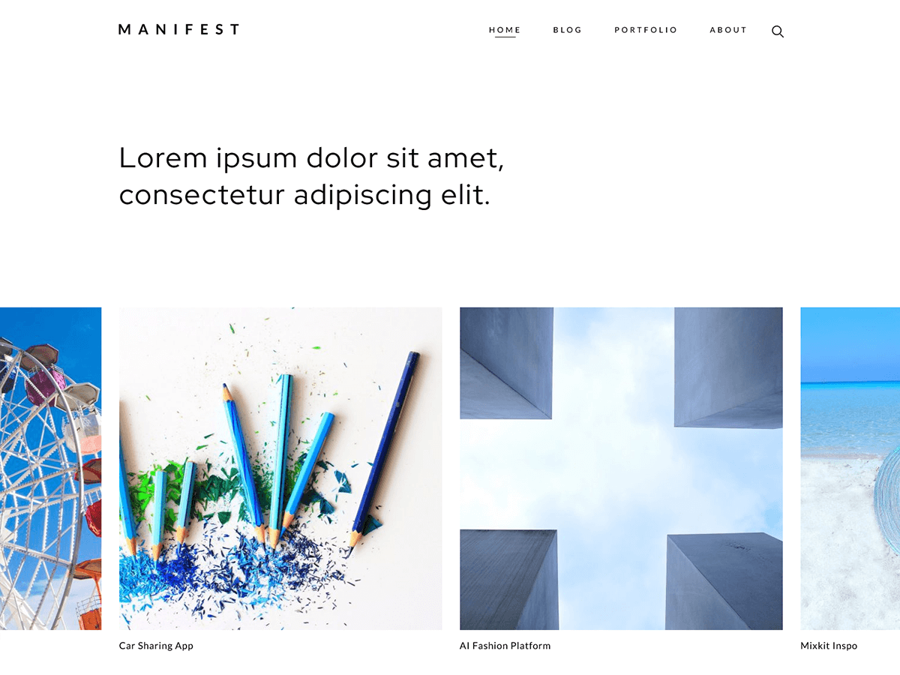

# WP-Manifest - [Demo](https://demo.vitathemes.com/manifest/) | [Download](https://wordpress.org/themes/wp-manifest/)
Just another minimal WordPress theme

## Features
* No additional JS
* Sass for stylesheets
* Compatible with [Contact Form 7](https://wordpress.org/plugins/contact-form-7/)
* Fast & lightweight (Google Speed: 99/100)
* Theme options built directly into WordPress native live theme customizer
* Responsive design
* Cross-browser compatibility
* Custom Google WebFonts
* Child themes support
* Developer friendly extendable code
* Translation ready (with .POT files included)
* Right-to-left (RTL) languages support
* SEO optimized
* GNU GPL version 2.0 licensed
* …and much more

See a working example at [https://demo.vitathemes.com/manifest/](https://demo.vitathemes.com/manifest/).

## Theme installation
1. Simply install as a normal WordPress theme and activate.
2. In your admin panel, navigate to `Appearance > Customize`.
3. Put the finishing touches on your website by adding a logo, typography settings, custom colors and etc.

## Theme setup

Edit `functions.php` to enable or disable theme features, setup navigation menus, post thumbnail sizes, and sidebars.

## Theme development

* Run `npm install` from the theme directory to install dependencies
* Run `npm run watch` from the root of theme directory and it's starting to watch any changes in scss files from the `sass` folder
